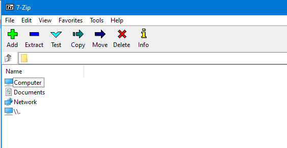
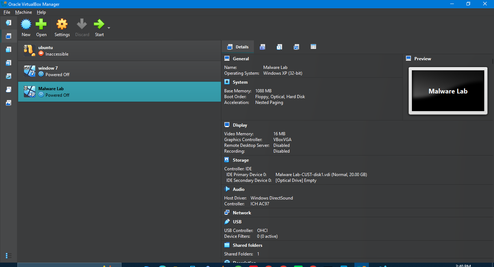
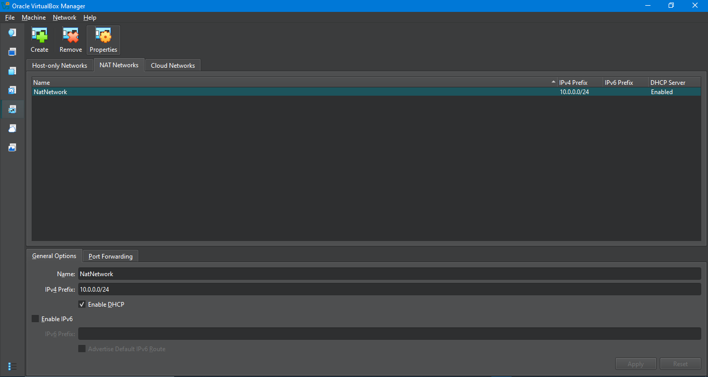
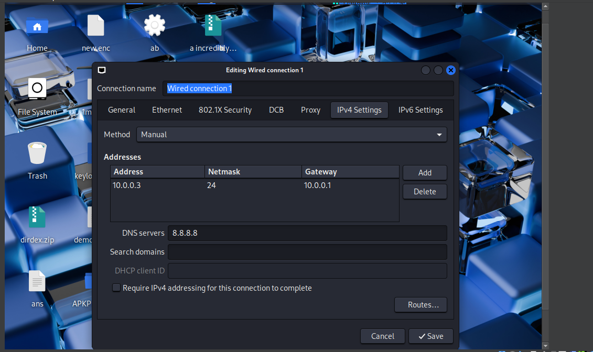
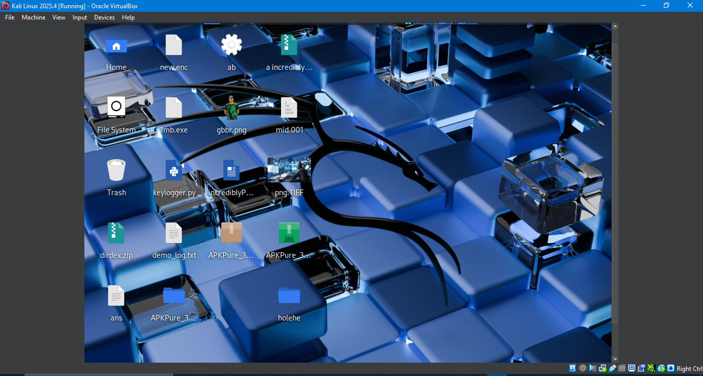
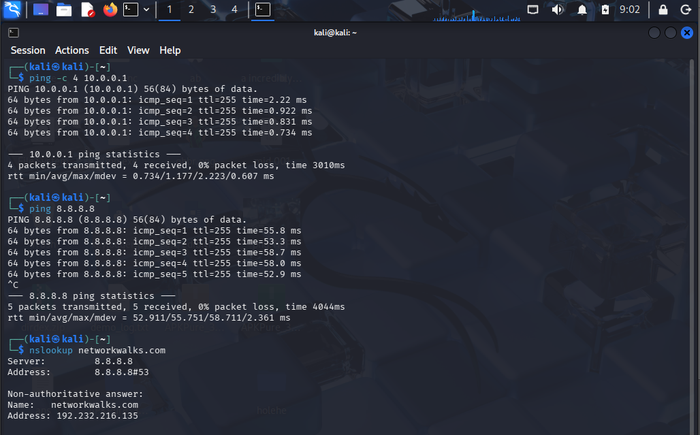
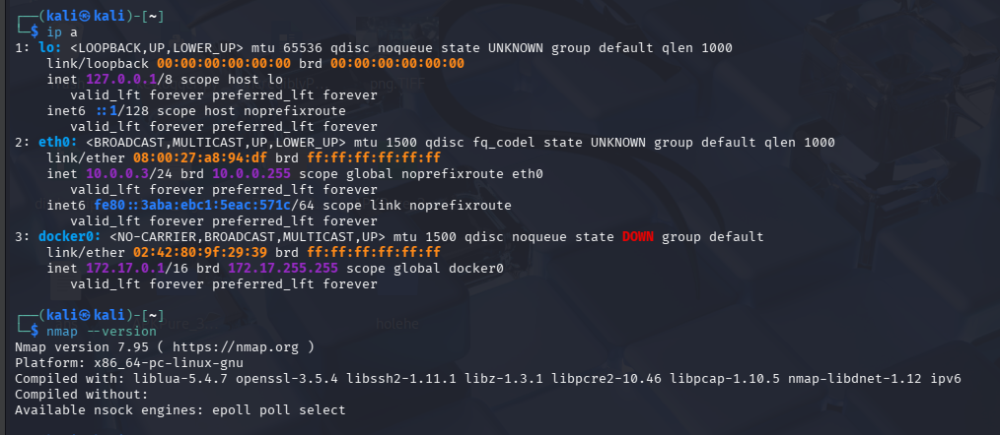

# NETWORKWALKS-EMMANUEL-B083-WK1-PM1-CYBERSECURITY-LAB-SETUP

**Cybersecurity Lab Environment Setup using VirtualBox and Kali Linux**

---

## 📌 Project Overview

This project focuses on setting up a basic virtual cybersecurity laboratory using **Oracle VirtualBox** and **Kali Linux**.

The lab provides a controlled environment for learning cybersecurity concepts and performing authorized security-testing activities.

---

## 🎯 Objectives

- Install 7-Zip.
- Install Oracle VirtualBox.
- Create a private NAT Network.
- Configure the lab network as `10.0.0.0/24`.
- Add Kali Linux to VirtualBox.
- Configure the Kali virtual machine.
- Verify network connectivity.
- Document the setup process with screenshots.
- Prepare the environment for future cybersecurity exercises.

---

## 🛡️ Ethical Use

This laboratory is intended for **educational and authorized security testing only**.

Only test systems that you own or have explicit permission to test.

---

# 🪜 Lab Setup Procedure

## Step 1 — Install 7-Zip

7-Zip was installed to extract and manage compressed virtual-machine files.

### Screenshot



---

## Step 2 — Install Oracle VirtualBox

Oracle VirtualBox was installed and opened successfully.

VirtualBox is being used as the hypervisor for the cybersecurity laboratory.

### Screenshot



---

## Step 3 — Create the NAT Network

A dedicated NAT Network named **NatNetwork** was created in VirtualBox.

### Network Configuration

| Setting | Value |
|---|---|
| Network Name | `NatNetwork` |
| IPv4 Prefix | `10.0.0.0/24` |
| DHCP | Enabled |
| IPv6 | Disabled |

The NAT Network allows virtual machines connected to the same network to communicate with each other while providing NAT-based network connectivity.

### Screenshot



---

## Step 4 — Configure Kali Linux Network Settings

The Kali Linux network settings were configured through the network connection settings.

The IPv4 configuration was checked to ensure that Kali is connected to the `10.0.0.0/24` lab network.

### Screenshot



## Step 5 — Kali Linux Virtual Machine

The Kali Linux virtual machine was successfully added and configured in VirtualBox.

The VM was configured with 2048 MB RAM and connected to the `NatNetwork`.

### Screenshot



# 🔎 Lab Verification

| **✅ Test** | **🧾 Command** | **🎯 Expected Result** |
|---|---|---|
| 🌐 Check IP address | `ip a` | Correct Kali IP displayed |
| 📡 Test gateway | `ping 10.0.0.1` | Successful replies |
| 🌍 Test Internet connectivity | `ping 8.8.8.8` | Successful replies |
| 🔎 Test DNS resolution | `nslookup networkwalks.com` | Domain resolves |
| 🧰 Verify Nmap | `nmap --version` | Nmap version displayed |
| 🔄 Verify snapshot | Restore snapshot and run `ip a` | Baseline configuration restored |

## 📸 Verification Screenshots

### Verification Screenshot 1



### Verification Screenshot 2



# 💡 What I Learned

While doing this lab, I learned how to set up a basic cybersecurity environment using VirtualBox and Kali Linux.

### 1. Setting Up a Virtual Lab

I learned how to use VirtualBox to create and manage virtual machines. I also learned how a virtual lab can be used to practice cybersecurity without directly affecting my main system.

### 2. Network Configuration

I learned how to create a NAT Network in VirtualBox and set the network range to `10.0.0.0/24`.

### 3. Connecting Kali Linux to the Network

I learned how to connect Kali Linux to the VirtualBox network and check its IP address using the `ip a` command.

### 4. Testing Network Connectivity

I learned how to check whether the network is working by using `ping`. I also learned how to test Internet connectivity and DNS resolution using `nslookup`.

### 5. Working With Virtual Machine Storage

I learned how to attach an existing Kali Linux `.vmdk` virtual disk to VirtualBox and use it as the storage for the virtual machine.

### 6. Importance of Snapshots

I learned that taking a snapshot before doing experiments is useful because it gives me a point to return to if something goes wrong.

### 7. Documenting the Work

I learned how to record the setup process with screenshots and organize the work in a GitHub repository using a README file.

```text
kali-linux-2025.4-vmware-amd64.vmdk


